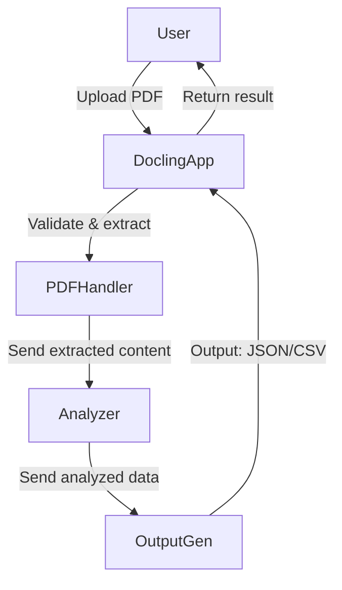
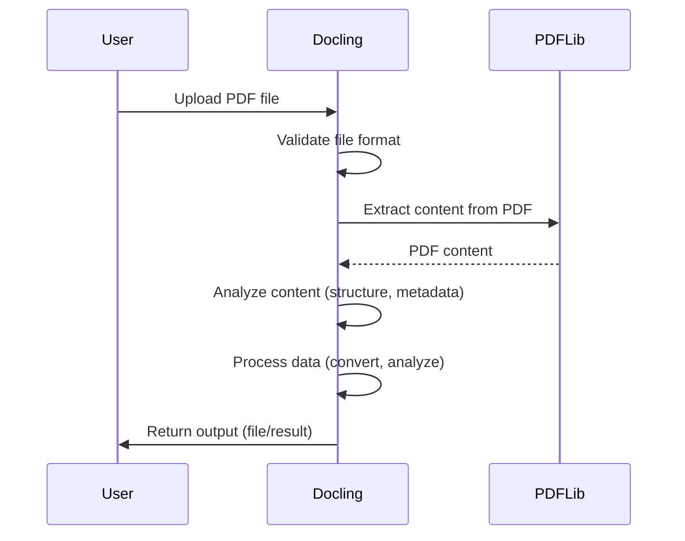

#### 1. Kiến trúc tổng quan
- Docling là ứng dụng Python, xử lý tài liệu PDF theo quy trình tự động.
- Sử dụng các thư viện như PyPDF2, pdfminer.six để trích xuất nội dung PDF.
- Hệ thống có thể triển khai dưới dạng web service (Flask/FastAPI) hoặc ứng dụng dòng lệnh.

#### 2. Quy trình xử lý PDF
- **Nhận file**: Người dùng upload file PDF qua giao diện hoặc API.
- **Kiểm tra định dạng**: Hệ thống xác thực file là PDF hợp lệ.
- **Trích xuất nội dung**: Sử dụng thư viện PDF để lấy text, hình ảnh, metadata.
- **Phân tích nội dung**: Tách đoạn, nhận diện tiêu đề, bảng, hình ảnh, trích xuất thông tin ngôn ngữ.
- **Xử lý dữ liệu**: Chuyển đổi sang các định dạng khác (JSON, CSV), phân tích ngôn ngữ, tạo báo cáo.
- **Trả kết quả**: Output có thể là file kết quả, dữ liệu JSON, hoặc hiển thị trực tiếp.

##### Kiến trúc

##### Mô tả chi tiết các module

- **DoclingApp**: Nhận file PDF từ người dùng qua giao diện web hoặc API. Kiểm tra định dạng file, lưu trữ tạm thời và chuyển tiếp cho module xử lý tiếp theo.

- **PDFHandler**: Kiểm tra tính hợp lệ của file PDF, sử dụng các thư viện như PyPDF2 hoặc pdfminer.six để trích xuất nội dung (text, hình ảnh, metadata). Xử lý các trường hợp lỗi hoặc file PDF không hợp lệ.

- **Analyzer**: Phân tích nội dung đã trích xuất, nhận diện cấu trúc văn bản (tiêu đề, đoạn, bảng, hình ảnh), trích xuất thông tin ngôn ngữ, phân loại nội dung. Có thể sử dụng các thuật toán NLP hoặc các thư viện như spaCy, NLTK.

- **OutputGen**: Chuyển đổi dữ liệu đã phân tích sang các định dạng đầu ra như JSON, CSV hoặc tạo báo cáo. Đảm bảo dữ liệu đầu ra đúng chuẩn, dễ sử dụng cho các hệ thống khác hoặc người dùng cuối. Có thể tích hợp chức năng xuất file hoặc trả về qua API.

##### Sequence Diagram (Mermaid)

#### 3. Các thành phần chính
- **Module nhập liệu**: Xử lý upload, xác thực file.
- **Module trích xuất**: Giao tiếp với thư viện PDF, lấy nội dung.
- **Module phân tích**: Xử lý text, nhận diện cấu trúc, phân tích ngôn ngữ.
- **Module xuất dữ liệu**: Chuyển đổi, lưu trữ, trả kết quả cho người dùng.

#### Chunking
Chunking là kỹ thuật chia nhỏ tài liệu thành các phần (chunk) hợp lý để phục vụ các tác vụ như phân tích, embedding, hoặc sinh dữ liệu. Docling hỗ trợ hai hướng chunking:

Chunking sau khi xuất Markdown: Tài liệu DoclingDocument được xuất ra Markdown, sau đó chunking được thực hiện như một bước xử lý hậu kỳ, do người dùng tự định nghĩa.
Chunking trực tiếp trên DoclingDocument (native chunkers): Sử dụng các chunker tích hợp sẵn của Docling để chia nhỏ tài liệu ngay trên cấu trúc DoclingDocument.
Docling định nghĩa một hệ thống chunker với lớp cơ sở BaseChunker và các lớp con chuyên biệt. Chunker nhận vào một DoclingDocument và trả về một stream các chunk (mỗi chunk là một đoạn văn bản kèm metadata).

Tích hợp AI: Docling chunker được thiết kế để dễ dàng tích hợp với các framework AI như LlamaIndex thông qua interface BaseChunker, cho phép sử dụng các chunker có sẵn, tự định nghĩa hoặc từ bên thứ ba.

BaseChunker API:

chunk(self, dl_doc: DoclingDocument, **kwargs) -> Iterator[BaseChunk]: Trả về các chunk của tài liệu.
contextualize(self, chunk: BaseChunk) -> str: Trả về chuỗi đã được bổ sung metadata, dùng cho embedding/generation model.
HybridChunker:

Kết hợp chunking theo cấu trúc tài liệu và tokenization-aware (theo tokenizer của embedding model).
Chia chunk khi vượt quá số lượng token cho phép, gộp các chunk nhỏ liên tiếp có cùng heading/caption (có thể tắt qua tham số merge_peers).
Sử dụng được với các tokenizer như HuggingFace hoặc OpenAI (tiktoken).
HierarchicalChunker:

Chunking dựa trên cấu trúc tài liệu, tạo một chunk cho mỗi phần tử tài liệu (heading, caption, list item, v.v.).
Tự động gộp các list item (có thể tắt qua tham số merge_list_items).
Đảm bảo metadata (header, caption) được gắn vào từng chunk.
#### 4. Công nghệ sử dụng

- **Python 3.x**: Ngôn ngữ lập trình chính, hỗ trợ mạnh mẽ cho xử lý dữ liệu và tài liệu.
- **PyPDF2**: Thư viện Python dùng để đọc, trích xuất văn bản, metadata từ file PDF. Hỗ trợ thao tác với các trang, trích xuất text, tách/gộp file PDF.
- **pdfminer.six**: Thư viện chuyên sâu cho việc trích xuất text, phân tích cấu trúc tài liệu PDF, nhận diện ký tự Unicode, hỗ trợ tốt cho các tài liệu phức tạp.
- **Flask/FastAPI**: Framework web Python, dùng để xây dựng API nhận file PDF, trả kết quả xử lý cho người dùng hoặc hệ thống khác. FastAPI hỗ trợ async, hiệu năng cao.
- **Pandas**: Thư viện xử lý dữ liệu dạng bảng, chuyển đổi dữ liệu trích xuất từ PDF sang các định dạng như CSV, Excel, JSON, hỗ trợ phân tích và trực quan hóa dữ liệu.
- **spaCy/NLTK**: Thư viện NLP dùng để phân tích ngôn ngữ tự nhiên, nhận diện thực thể, phân loại nội dung, tách câu, đoạn trong văn bản PDF.
- **PlantUML/Mermaid**: Công cụ mô tả quy trình, kiến trúc hệ thống bằng sơ đồ trực quan.
- **Werkzeug**: Thư viện hỗ trợ cho Flask, dùng để xử lý upload file, bảo mật, quản lý session.
- **Jinja2**: Template engine cho Flask, hỗ trợ tạo giao diện web hiển thị kết quả xử lý PDF.
- **pytest/unittest**: Framework kiểm thử tự động cho các module xử lý PDF, đảm bảo chất lượng phần mềm.

#### 5. Mở rộng
- Hỗ trợ nhiều định dạng đầu vào (Word, hình ảnh).
- Tích hợp AI để nhận diện cấu trúc phức tạp, trích xuất thông tin nâng cao.
- Tích hợp với hệ thống lưu trữ hoặc phân tích dữ liệu lớn.

